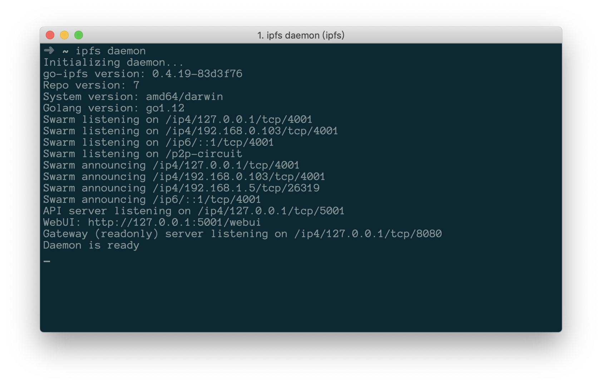

# files 2 ipfs

> 通过本地 web 页面上传加密后的文件到 ipfs。

## 关键技术

- ipfs: 
- koa: Node.js 服务器框架[:koa:](https://koa.com/)

## 用法

### 配置本地的ipfs节点
1. 初始化ipfs节点

  ```bash
  ipfs init
  ```

1. 运行 ipfs 节点
```bash
ipfs daemon
```


更多配置参考[官网:link:](https://docs.ipfs.io/introduction/usage/)

